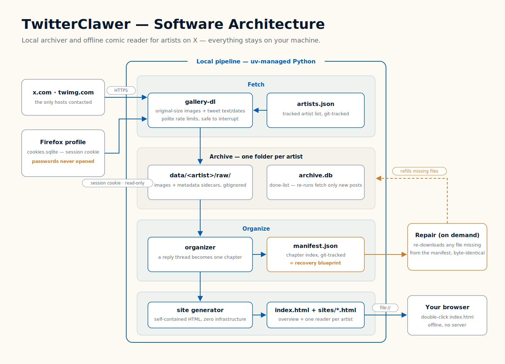
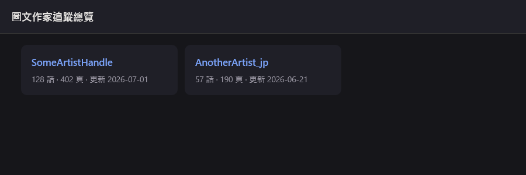

# TwitterClawer

**Follow comic artists on X (Twitter) and read their work like a real comic — offline, in order, on your own machine.**

[User guide / 使用說明（網頁右上角可切中文）→ docs/index.html](docs/index.html)





> Reader-page screenshots are deliberately not included: the archived images
> belong to the artists. Open `index.html` on your own archive to see it in action.

## Why

Some artists publish entire comic series as X posts. Reading them there means
hunting through hundreds of scattered posts, in reverse order, past ads and
replies. I follow one such artist and wanted the whole series readable like a
book — and to keep my own copy in case posts disappear.

## What it does

- **Tracks a list of artists** (`artists.json`). Add one by pasting their
  profile URL; each artist gets a fully separate archive and reader page —
  nothing is ever mixed.
- **Downloads original-resolution images** plus tweet text and dates via
  [gallery-dl](https://github.com/mikf/gallery-dl), reusing your Firefox
  login **session cookie read-only** — passwords are never touched, and the
  tool talks only to `x.com` / `twimg.com`.
- **Rebuilds chapters**: a self-reply thread becomes one episode, ordered by
  time, titled from the first post.
- **Generates a static comic reader** — double-click `index.html`, no server,
  fully offline. Vertical-scroll reading, keyboard navigation, dark theme.
- **Survives data loss**: the chapter index (`manifest.json`) is
  version-controlled and doubles as a recovery blueprint — a repair command
  re-downloads any missing file byte-for-byte.
- **Incremental by design**: re-running only fetches what's new
  (per-artist `archive.db`, early-abort after 30 known files).

First archived artist: **344 episodes / 926 pages**, fetched in one run.

## Everyday use (Windows)

| Action | Double-click |
|---|---|
| Follow a new artist (paste URL) | `add-artist.bat` |
| First full download (long; safe to interrupt & re-run) | `first-download.bat` |
| Fetch new posts after an artist updates | `update.bat` |
| Restore missing / corrupted files | `repair.bat` |
| Read | `index.html` → pick artist → pick episode |

Reader keys: `←` older episode · `→` newer episode · `Esc` back to list.

## How to run

Prerequisites: [uv](https://docs.astral.sh/uv/), Firefox logged in to x.com.

```bash
uv run twitterclawer add https://x.com/SomeArtist   # track + full download
uv run twitterclawer update                          # incremental, all artists
uv run twitterclawer update --artist SomeArtist      # just one
uv run twitterclawer repair                          # refill missing files
uv run twitterclawer build                           # regenerate pages only

# development
uv run pytest -q             # 78 tests
uv run ruff check src tests
```

If X changes and downloads break: `uv lock --upgrade-package gallery-dl`.

Your tracked list (`artists.json`) and per-artist chapter indexes live only on
your machine — they are never part of this repository. See
`artists.example.json` and `docs/examples/manifest.example.json` for the file
formats.

## Design notes

- **Python (uv-managed)**, ~600 lines across seven small modules
  (roster / downloader / organizer / manifest / sitegen / repair / cli),
  built test-first — 78 pytest cases including path-traversal and XSS
  regression tests from an adversarial code review.
- Reader pages are **single self-contained HTML files** (manifest embedded,
  `file://`-safe) so the archive needs zero infrastructure.
- Everything artist-generated (`data/`, `sites/`) is gitignored; only code and
  chapter indexes are version-controlled. The codebase contains no account
  data and no hardcoded artist names.

## Copyright

Downloaded content belongs to its artists. This tool exists for **personal
offline reading** — do not republish archived images or generated pages.
Support the artists you follow.

## Credits

- [gallery-dl](https://github.com/mikf/gallery-dl) does the heavy lifting of
  talking to X.
- Built with [uv](https://docs.astral.sh/uv/), pytest and ruff.
